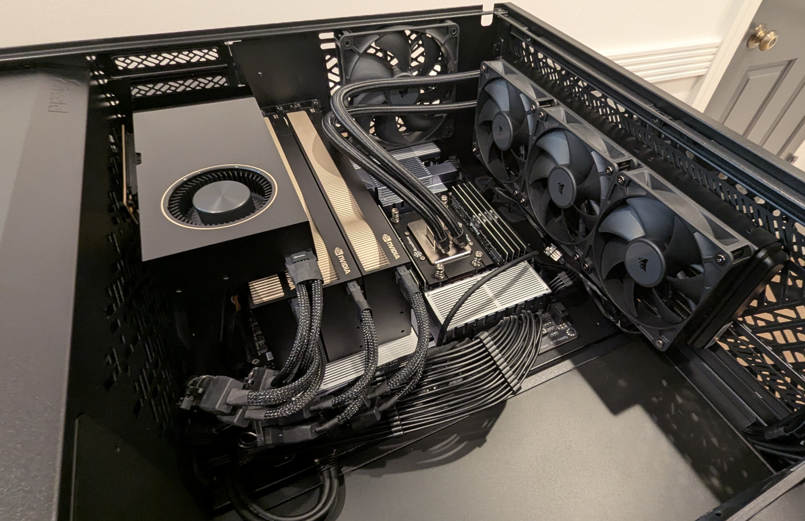

# Single-Outlet Inference

A workstation serving [MiniMax-M3](https://huggingface.co/nvidia/MiniMax-M3-NVFP4)
(428B params / 23B active, NVFP4, 1M-token context) with
[vLLM](https://github.com/nick-oconnor/vllm).



## Benchmarks

16 prompts, concurrency 4, per row.

| Input Tokens | Output Tokens | Decode (tok/s) | p50 TTFT  | p50 ITL  |
| --------- | ---------- | -------------- | --------- | -------- |
| 2048      | 256        | 259            | 158ms     | 15ms     |
| 8192      | 1024       | 243            | 174ms     | 16ms     |
| 32768     | 4096       | 199            | 8448ms    | 17ms     |
| 131072    | 8192       | 132            | 38495ms   | 22ms     |

PSU output (self-reported via the PSU's USB interface): ~280W idle, ~1.5kW under bench load, 1.71kW peak.

## Hardware

| Component | Spec |
|---|---|
| Motherboard | Gigabyte TRX50 AI TOP |
| CPU | 1x AMD Ryzen Threadripper PRO 9985WX |
| Memory | 8x Kingston KF556R28-32 RDIMM, EXPO 1 |
| GPU | 4x NVIDIA RTX PRO 6000 Blackwell Max-Q, ECC enabled |
| Interconnect | 4x PCIe Gen 5 x16 |
| PSU | 1x Corsair HX1500i, 20A 120V circuit |
| OS / driver | Debian 13, kernel 6.12.95, NVIDIA 610.43.02, CUDA 13.3 |

Memory Bandwidth:

| Threads | Pinning | Copy |
| --- | --- | --- |
| 8 | 1 per CCD | 269GB/s |
| 16 | 2 per CCD (SMT pair) | 299GB/s |
| 32 | 4 per CCD | 189GB/s |
| 128 | default | 138GB/s |

PCIe Topology:

|     | GPU0 | GPU1 | GPU2 | GPU3 |
| --- | ---- | ---- | ---- | ---- |
| GPU0 | X    | NODE | NODE | NODE |
| GPU1 | NODE | X    | NODE | NODE |
| GPU2 | NODE | NODE | X    | NODE |
| GPU3 | NODE | NODE | NODE | X    |

PCIe Speed (between GPU pairs):

| P2P        | Unidirectional | Bidirectional | Latency (GPU) | Latency (CPU) |
| ---------- | -------------- | ------------- | ------------- | ------------- |
| disabled   | 44GB/s         | 58GB/s        | 14us          | 5us           |
| enabled    | 55GB/s         | 105GB/s       | 0.5us         | 1us           |

## Model

- [nvidia/MiniMax-M3-NVFP4](https://huggingface.co/nvidia/MiniMax-M3-NVFP4)
  (428B params, 23B active per token)
- Weights: 428B params x 0.5 bytes (NVFP4) = ~214GB; checkpoint on disk is
  233 GiB across 88 safetensors shards

## vLLM Build

Fork: [github.com/nick-oconnor/vllm](https://github.com/nick-oconnor/vllm).
Upstream-tracking, with SM120-specific config and M3 patches.

Build constraints:

- GPUs are SM 12.0 (Blackwell consumer). `TORCH_CUDA_ARCH_LIST="12.0"`.
- Prebuilt FlashInfer wheels do not include SM120 FP4/CUTLASS MoE kernels.
  FlashInfer is built from source at a commit that ships them.
- SM120 GEMM kernels are not in any tagged CUTLASS release. CUTLASS is pinned
  to upstream HEAD.
- FlashInfer JITs the SM120 CUTLASS MoE kernels at server startup. The
  `cuda-nvrtc-dev` package must be in the runtime image, not just the build
  image, or the server fails to boot.

```bash
git clone --branch 0.25 https://github.com/nick-oconnor/vllm.git
cd vllm
docker build -f docker/Dockerfile -t vllm:0.25.1-sm120-cu133 .
```

Pre-built amd64 image: [ngpitt/vllm:0.25.1-sm120-cu133](https://hub.docker.com/r/ngpitt/vllm/tags?name=0.25.1-sm120-cu133).

## vLLM Execution

```bash
docker run --rm --gpus all --ipc=host \
  -v <host-models-path>:/models:ro \
  -v <host-cache-path>:/home/vllm \
  -p 8000:8000 \
  -e HF_HUB_OFFLINE=1 \  # weights come from the local /models mount, not the Hub
  -e NCCL_P2P_LEVEL=NODE \  # NCCL can't auto-detect P2P from inside the container; declare it manually
  -e RAYON_NUM_THREADS=4 \  # cap the Rayon thread pool (used by tokenizers/parquet)
  -e MAX_JOBS=32 \  # cap JIT parallelism so container PIDs stay sane
  -e VLLM_FLASHINFER_AUTOTUNE_PROCESS_GROUP=1 \  # sync FlashInfer autotune tactic choice across TP ranks during warmup
  -e VLLM_KV_OFFLOAD_COLLECTIVE_BARRIER=1 \  # host-side barrier after OffloadingConnector.start_load_kv to prevent the TP rank desync on KV load
  vllm:0.25.1-sm120-cu133 \
    /models/nvidia/MiniMax-M3-NVFP4 \
      --served-model-name MiniMax-M3-NVFP4 \
      --tensor-parallel-size 4 \  # 4-way TP across the four GPUs
      --enable-expert-parallel \  # M3 is 128 routed experts with 4 active per token plus 1 shared
      --trust-remote-code \
      --tokenizer-mode hf \
      --max-model-len auto \  # resolves to 1048576 at startup; the GPU KV cache is 1,136,384 tokens (31.71 GiB) so the full 1M context fits with ~87k tokens of headroom
      --max-num-seqs 4 \
      --max-num-batched-tokens 8192 \
      --gpu-memory-utilization 0.97 \  # 58.59 GiB/shard weights; with fp8 KV at 1M-token context the budget is ~17 GiB/shard
      --kv-cache-dtype fp8 \
      --kv-offloading-size 100 \  # 100 GiB host-RAM offload buffer; speeds up long-context requests under concurrent load
      --kv-offloading-backend native \
      --attention-backend TRITON_ATTN \  # FlashAttn's fp8 path needs SM90/Hopper; FlashInfer then caps block sizes at 64 on SM120; M3 sparse requires exactly 128; Triton reconciles both
      --moe-backend flashinfer_cutlass \  # only NVFP4 MoE backend on SM120 that actually applies M3's SWIGLUOAI_UNINTERLEAVE clamp; TRTL-LM maps to plain Swiglu and silently drops the bias params
      --block-size 128 \  # M3 sparse attention requires it
      --enable-prefix-caching \
      --enable-chunked-prefill \
      --tool-call-parser minimax_m3 \
      --reasoning-parser minimax_m3 \
      --enable-auto-tool-choice \
      --limit-mm-per-prompt '{"image":1,"video":0}'  # disable video support to enable full context length
```

---

Operational deep-dive — build/deploy config, the full launch-blocker list, and production-incident post-mortems — lives in [`notes/`](notes/).


