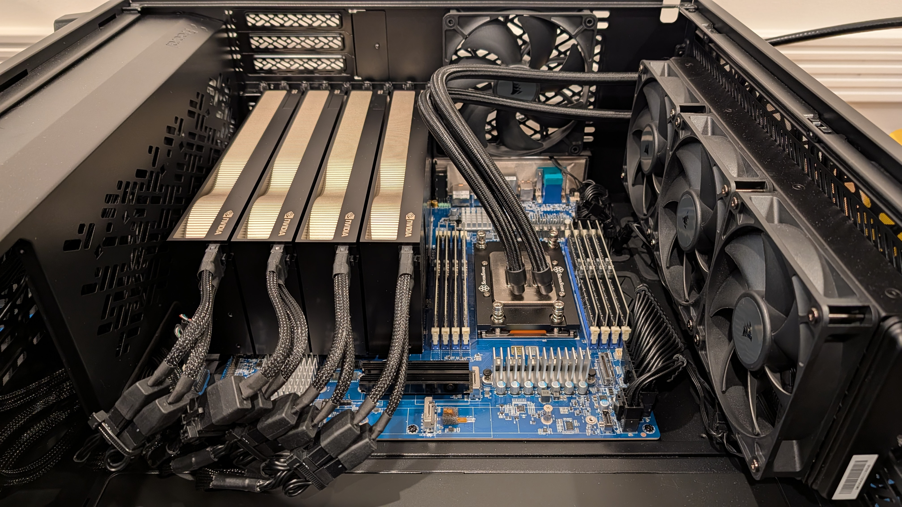

# Single-Outlet Inference

A workstation serving [DeepSeek-V4-Flash-0731](https://huggingface.co/deepseek-ai/DeepSeek-V4-Flash-0731)
(284B MoE / 13B active, fp8, 1M-token context) with
[vLLM](https://github.com/nick-oconnor/vllm).



## Benchmarks

16 prompts, concurrency 4, per row.

| Input Tokens | Output Tokens | Decode (tok/s) | p50 TTFT  | p50 ITL  |
| --------- | ---------- | -------------- | --------- | -------- |
| 2048      | 256        | 242            | 65ms      | 12ms     |
| 8192      | 1024       | 329            | 60ms      | 12ms     |
| 32768     | 4096       | 271            | 6860ms    | 12ms     |
| 131072    | 8192       | 214            | 32776ms   | 13ms     |

PSU output (self-reported via the PSU's USB interface): ~280W idle, ~1.5kW under bench load, 1.71kW peak.

## Hardware

| Component | Spec |
|---|---|
| Motherboard | Gigabyte MH53-G40 |
| CPU | 1x AMD Ryzen Threadripper PRO 9985WX |
| Memory | 8x Kingston KF556R28-32 RDIMM, EXPO 1 |
| GPU | 4x NVIDIA RTX PRO 6000 Blackwell Max-Q, ECC enabled |
| Interconnect | 4x PCIe Gen 5 x16 |
| PSU | 1x Corsair HX1500i, 20A 120V circuit |
| OS / driver | Debian 13, kernel 6.12.95, NVIDIA 610.43.02, CUDA 13.3 |

Memory Bandwidth:

| Threads | Pinning | Copy |
| --- | --- | --- |
| 8 | 1 per CCD | 263GB/s |
| 16 | 2 per CCD (SMT pair) | 293GB/s |
| 32 | 4 per CCD | 209GB/s |
| 128 | default | 137GB/s |

PCIe Topology:

|     | GPU0 | GPU1 | GPU2 | GPU3 |
| --- | ---- | ---- | ---- | ---- |
| GPU0 | X    | NODE | NODE | NODE |
| GPU1 | NODE | X    | NODE | NODE |
| GPU2 | NODE | NODE | X    | NODE |
| GPU3 | NODE | NODE | NODE | X    |

PCIe Speed (between GPU pairs):

| P2P        | Unidirectional | Bidirectional | Latency (GPU) | Latency (CPU) |
| ---------- | -------------- | ------------- | ------------- | ------------- |
| disabled   | 44GB/s         | 58GB/s        | 14us          | 5us           |
| enabled    | 55GB/s         | 105GB/s       | 0.5us         | 1us           |

## Model

- [deepseek-ai/DeepSeek-V4-Flash-0731](https://huggingface.co/deepseek-ai/DeepSeek-V4-Flash-0731)
  (284B params, 13B active per token, 1M-token context)
- fp8 (block-scaled dense layers + MXFP4 MoE experts); ~167 GB checkpoint on
  disk, served from `/models/deepseek-ai/DeepSeek-V4-Flash-0731` on the local
  models mount

## vLLM Build

Fork: [github.com/nick-oconnor/vllm](https://github.com/nick-oconnor/vllm).
Upstream-tracking, rebased onto v0.26.0 which supports DeepSeek-V4 natively.
The ocnr SM120-specific config (`0.26.0+sm120.cu133`) sits on top.

Build constraints:

- GPUs are SM 12.0 (Blackwell consumer). `TORCH_CUDA_ARCH_LIST="12.0"`.
- Several SM120 kernels (DeepGEMM fp8 MoE, TileLang, FlashInfer autotune) need
  the matching CUDA toolchain; CUTLASS comes from the `nvidia-cutlass-dsl==4.5.2`
  PyPI wheel (no tagged release ships the SM120 GEMM kernels).
- FlashInfer and TileLang JIT kernels at server startup (the boot log shows
  TileLang compiling `mhc_pre_big_fuse_*` on each worker). The `cuda-nvrtc-dev`
  package must be in the runtime image, not just the build image, or the server
  fails to boot.

```bash
git clone --branch 0.26 https://github.com/nick-oconnor/vllm.git
cd vllm
docker build -f docker/Dockerfile -t vllm:0.26.0-sm120-cu133 .
```

Pre-built amd64 image: [ngpitt/vllm:0.26.0-sm120-cu133](https://hub.docker.com/r/ngpitt/vllm/tags?name=0.26.0-sm120-cu133).

## vLLM Execution

```bash
docker run --rm --gpus all --ipc=host \
  -v <host-models-path>:/models:ro \
  -v <host-cache-path>:/home/vllm \
  -p 8000:8000 \
  -e HF_HUB_OFFLINE=1 \  # weights come from the local /models mount, not the Hub
  -e NCCL_P2P_LEVEL=NODE \  # NCCL can't auto-detect P2P from inside the container; declare it manually
  -e RAYON_NUM_THREADS=4 \  # cap the Rayon thread pool (used by tokenizers/parquet)
  -e MAX_JOBS=32 \  # cap JIT parallelism so container PIDs stay sane
  -e VLLM_FLASHINFER_AUTOTUNE_PROCESS_GROUP=1 \  # sync FlashInfer autotune tactic choice across TP ranks during warmup
  -e VLLM_KV_OFFLOAD_COLLECTIVE_BARRIER=1 \  # host-side barrier after OffloadingConnector.start_load_kv to prevent the TP rank desync on KV load
  vllm:0.26.0-sm120-cu133 \
    /models/deepseek-ai/DeepSeek-V4-Flash-0731 \
      --served-model-name DeepSeek-V4-Flash-0731 \
      --tensor-parallel-size 4 \  # 4-way TP across the four GPUs
      --enable-expert-parallel \  # 256 routed MoE experts, sharded 64 per TP rank
      --trust-remote-code \
      --tokenizer-mode deepseek_v4 \  # DeepSeek-V4's custom encoder + tokenizer strategy (deepseek_v4)
      --max-model-len auto \  # resolves to the full 1,048,576-token context; auto-fit confirms the 1,581,597-token fp8 KV cache fits the whole 1M
      --max-num-seqs 4 \
      --max-num-batched-tokens 16384 \
      --gpu-memory-utilization 0.7 \  # deliberate: leaves ~30% GPU memory unallocated for co-resident workloads on the box (comfyui), not for KV growth
      --kv-cache-dtype fp8 \  # model ships fp8 (block-scaled + MXFP4 MoE); fp8 KV cache matches it and fits the 1M context
      --kv-offloading-size 100 \  # 100 GiB host-RAM offload buffer; speeds up long-context requests under concurrent load
      --kv-offloading-backend native \
      --block-size 256 \  # DeepSeek-V4's compressed sparse-MLA cache has heterogeneous block groups; 256 is the full-MLA group (SWA=64, C4 states=4, C128 states=8 are derived internally)
      --enable-prefix-caching \
      --enable-chunked-prefill \
      --tool-call-parser deepseek_v4 \
      --reasoning-parser deepseek_v4 \
      --enable-auto-tool-choice \
      --default-chat-template-kwargs '{"thinking": true}'  # force thinking mode on every turn
```

---

Operational deep-dive — build/deploy config, the full launch-blocker list, and production-incident post-mortems — lives in [`notes/`](notes/).


