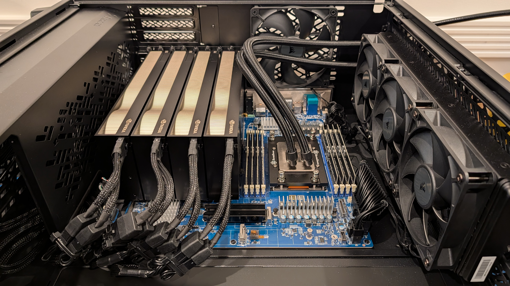

# Single-Outlet Inference

A workstation serving [GLM-5.3-Flash](https://huggingface.co/nvidia/GLM-5.3-Flash-NVFP4)
(sparse-MLA MoE with native vision, 1M-token context) with
[vLLM](https://github.com/nick-oconnor/vllm).



## Benchmarks

GLM-5.3-Flash (NVFP4 checkpoint, MTP3 speculative decoding) on vLLM
`0.30.0-sm120-cu130` with native KV offload and the b12x PCIe one-shot
all-reduce. 16 prompts, concurrency 1, random dataset, zero
failed requests. Decode is the MTP output rate (~2.4 accepted tokens/step);
all TTFTs are cold prefill (fresh boot, empty cache).

| Input Tokens | Output Tokens | Decode (tok/s) | Median TTFT | Median ITL |
| --------- | ---------- | -------------- | --------- | -------- |
| 2048      | 256        | 129.43         | 189ms     | 16.47ms  |
| 8192      | 1024       | 127.36         | 702ms     | 16.54ms  |
| 32768     | 4096       | 130.75         | 2468ms    | 16.62ms  |
| 131072    | 8192       | 128.92         | 9302ms    | 16.79ms  |

PSU output (self-reported via the PSU's USB interface): 262W idle, 1.15kW
under bench load, 1.68kW peak.

## Hardware

| Component | Spec |
|---|---|
| Motherboard | Gigabyte MH53-G40 |
| CPU | 1x AMD Ryzen Threadripper PRO 9985WX |
| Memory | 8x Kingston KF556R28-32 RDIMM, EXPO 1 |
| GPU | 4x NVIDIA RTX PRO 6000 Blackwell Max-Q, ECC enabled |
| Interconnect | 4x PCIe Gen 5 x16 |
| PSU | 1x Corsair HX1500i, 20A 120V circuit |
| OS / driver | Debian 13, kernel 7.1.13, NVIDIA 615.71.09, CUDA 13.4 |

Memory Bandwidth:

| Threads | Pinning | Copy |
| --- | --- | --- |
| 8 | 1 per CCD | 263GB/s |
| 16 | 2 per CCD (SMT pair) | 293GB/s |
| 32 | 4 per CCD | 209GB/s |
| 128 | default | 137GB/s |

PCIe Topology:

|     | GPU0 | GPU1 | GPU2 | GPU3 |
| --- | ---- | ---- | ---- | ---- |
| GPU0 | X    | NODE | NODE | NODE |
| GPU1 | NODE | X    | NODE | NODE |
| GPU2 | NODE | NODE | X    | NODE |
| GPU3 | NODE | NODE | NODE | X    |

PCIe Speed (between GPU pairs):

| P2P        | Unidirectional | Bidirectional | Latency (GPU) | Latency (CPU) |
| ---------- | -------------- | ------------- | ------------- | ------------- |
| disabled   | 44GB/s         | 58GB/s        | 14us          | 5us           |
| enabled    | 55GB/s         | 105GB/s       | 0.5us         | 1us           |

## Model

[GLM-5.3-Flash](https://huggingface.co/zai-org/GLM-5.3-Flash) — sparse-MLA
MoE, 320B total / 18B active parameters, 45 layers, 1M-token context,
text + image + video input, text output. Approaches Claude Opus 4.8 on
coding and agentic benchmarks.

Served checkpoint:
[nvidia/GLM-5.3-Flash-NVFP4](https://huggingface.co/nvidia/GLM-5.3-Flash-NVFP4),
NVIDIA's NVFP4 quantization of GLM-5.3-Flash — MoE experts and dense MLP run
4-bit weights and activations, attention / router / lm_head / MTP head stay
at source precision (~3.3× smaller than the 16-bit model; NVIDIA's evals
show accuracy parity).

## vLLM Build

Fork: [github.com/nick-oconnor/vllm](https://github.com/nick-oconnor/vllm),
branch `0.30`, tagged `0.30.0-sm120-cu130` (upstream `main` base
`924707f1bf`; GLM-5.3-Flash model support is native upstream since
vllm-project #53906). The branch carries, vs upstream:

- the SM120 NoPE sparse-MLA port (hardware-verified serving path)
- the b12x PCIe one-shot all-reduce backend (`VLLM_ENABLE_PCIE_ALLREDUCE`)
- the SM120 image build (Blackwell consumer)
- #55222 — right-sizes the indexer prefill workspace and sizes the prefill
  chunk budget in compressed rows; without it, #55221 caps auto-fit
  `max_model_len` at 516K and loses the 1M context
- #55601 — seeds the hybrid mamba state index by `mamba_block_size`
  (the prefix-cache KV-corruption fix)
- #57635 — per-rank FlashInfer autotune cache files
- SM120 sparse-MLA warmup tunes all ranks; leader-only tuning left
  asymmetric tuner state that deadlocked the synchronized autotune
- mamba aligned-split uses the scheduler-resolved block size;
  `cache_config.block_size` gets reassigned to the smallest
  prefix-cacheable group

Full fix list: [`notes/serving-config.md`](notes/serving-config.md).

Build constraints:

- GPUs are SM 12.0 (Blackwell consumer). `TORCH_CUDA_ARCH_LIST="12.0"`.
- Several SM120 kernel paths (DeepGEMM fp8 MoE, TileLang, FlashInfer runtime
  JIT) need the matching CUDA toolchain; CUTLASS comes from the
  `nvidia-cutlass-dsl==4.7.1` PyPI wheel (upstream's requirement since the
  DSL 4.7 bump).
- **b12x** comes from the `b12x==1.3.0` PyPI wheel — CuTe DSL PCIe one-shot
  all-reduce kernels (`b12x.comm.pcie`); no native extension build.
- FlashInfer and TileLang JIT kernels at server startup (the boot log shows
  TileLang compiling `mhc_pre_big_fuse_*` on each worker). The `cuda-nvrtc-dev`
  package must be in the runtime image, not just the build image, or the server
  fails to boot.

```bash
git clone --branch 0.30 https://github.com/nick-oconnor/vllm.git
cd vllm
docker build -f docker/Dockerfile -t vllm:0.30.0-sm120-cu130 .
```

Pre-built amd64 image: [ngpitt/vllm:0.30.0-sm120-cu130][hub] (amd64,
`sha256:3399d4fc8fc5ae9fcbd393b09f00adbb57fd67939246108fe7f98b139ded826a`).

[hub]: https://hub.docker.com/r/ngpitt/vllm/tags?name=0.30.0-sm120-cu130

## vLLM Execution

| Flag | Notes |
| --- | --- |
| `--shm-size` | NCCL bootstrap, engine IPC, 100 GiB KV-offload mmap |
| `HF_HUB_OFFLINE` | weights come from the local `/models` mount, not the Hub |
| `NCCL_P2P_LEVEL` | NCCL can't auto-detect P2P inside the container |
| `RAYON_NUM_THREADS` | cap the Rayon thread pool (tokenizers/parquet) |
| `OMP_NUM_THREADS` | cap the OpenMP thread pool |
| `MAX_JOBS` | cap JIT parallelism so container PIDs stay sane |
| `VLLM_ENABLE_PCIE_ALLREDUCE` | enables the b12x one-shot all-reduce backend |
| `--tensor-parallel-size` | 4-way TP across the four GPUs |
| `--max-model-len` | auto-fit; holds the full 1M via the #55222 right-size |
| `--gpu-memory-utilization` | leaves ~24 GiB/GPU free for the image workload |
| `--moe-backend` | NVFP4 MoE; pinned, `auto` may drift |
| `--kv-offloading-*` | native CPU KV offload: 100 GiB pool in `/dev/shm` |
| `--speculative-config` | MTP speculative decoding, 3 draft tokens |
| `--default-chat-template-kwargs` | force thinking mode on every turn |

```bash
docker run --rm --gpus all --shm-size 120g \
  -v <host-models-path>:/models:ro \
  -v <host-cache-path>:/home/vllm \
  -p 8000:8000 \
  -e HF_HUB_OFFLINE=1 \
  -e NCCL_P2P_LEVEL=NODE \
  -e RAYON_NUM_THREADS=4 \
  -e OMP_NUM_THREADS=4 \
  -e MAX_JOBS=32 \
  -e VLLM_ENABLE_PCIE_ALLREDUCE=1 \
  vllm:0.30.0-sm120-cu130 \
    /models/nvidia/GLM-5.3-Flash-NVFP4 \
      --served-model-name GLM-5.3-Flash \
      --tensor-parallel-size 4 \
      --enable-expert-parallel \
      --trust-remote-code \
      --max-model-len auto \
      --max-num-seqs 4 \
      --max-num-batched-tokens 8192 \
      --gpu-memory-utilization 0.69 \
      --moe-backend flashinfer_cutlass \
      --kv-cache-dtype fp8 \
      --enable-prefix-caching \
      --kv-offloading-size 100 \
      --kv-offloading-backend native \
      --enable-chunked-prefill \
      --speculative-config '{"method": "mtp", "num_speculative_tokens": 3}' \
      --tool-call-parser glm47 \
      --reasoning-parser glm45 \
      --enable-auto-tool-choice \
      --limit-mm-per-prompt '{"image": 20, "video": 0}' \
      --default-chat-template-kwargs '{"thinking": true}'
```

---

Operational deep-dive — build/deploy config, the full launch-blocker list, and
production-incident post-mortems — lives in [`notes/`](notes/).
